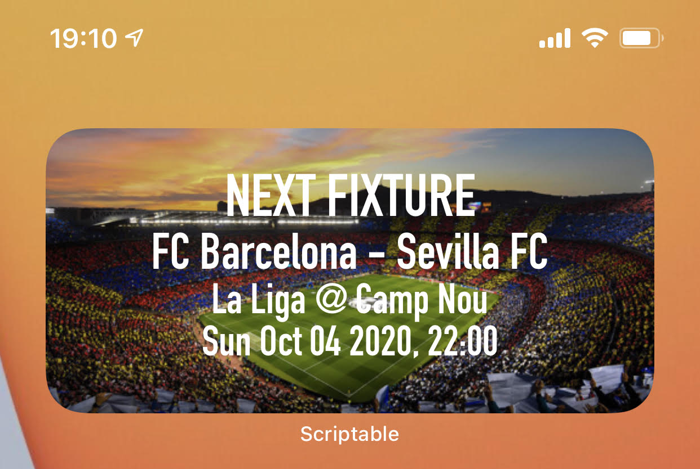

# footballTermiWidget
based on https://github.com/evandcoleman/scriptable
## iOS 14 Scriptable widget for the next FCBarcelona game + some info
# Screenshot



# How to use:
1. Set the ```TEAM_ID``` variable with your team's id
2. Set the ```WEATHER_API_KEY``` variable with your openweather key
3. Run the script and add it to your home-screen
